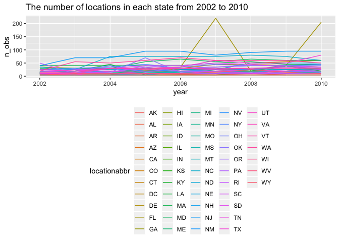
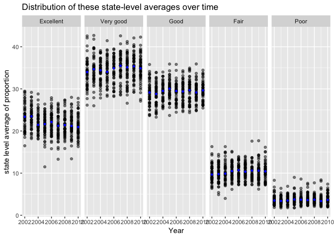
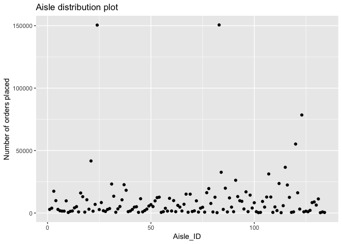
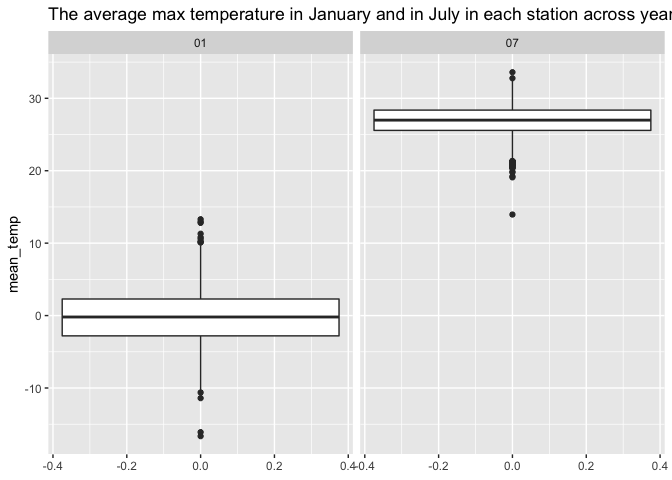
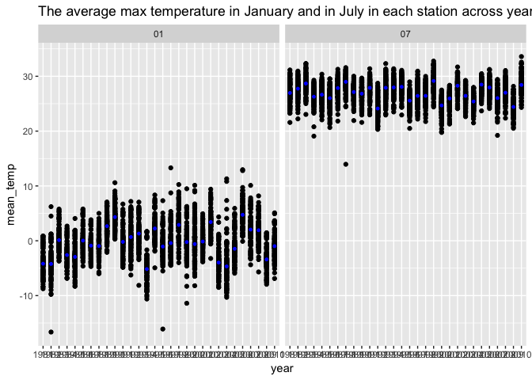
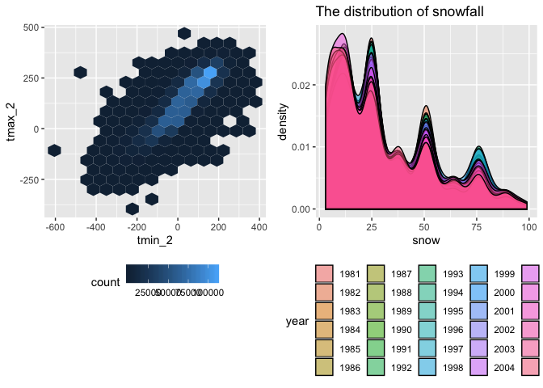

P8105\_hw3\_xy2404
================
Annie Yu
10/14/2018

Problem 1:
==========

``` r
library(p8105.datasets)
data(brfss_smart2010)
brfss =
  brfss_smart2010 %>% 
  janitor::clean_names() %>%
  filter(topic == "Overall Health") %>% 
  mutate(response = forcats::fct_relevel(response, c("Excellent", "Very good", "Good", "Fair", "Poor")))
```

The original dataset contains Year, Locationabbr, Locationdesc, Class, Topic, Question, Response, Sample\_Size, Data\_value, Confidence\_limit\_Low, Confidence\_limit\_High, Display\_order, Data\_value\_unit, Data\_value\_type, Data\_Value\_Footnote\_Symbol, Data\_Value\_Footnote, DataSource, ClassId, TopicId, LocationID, QuestionID, RESPID, GeoLocation variables. In original data, there are 23 variables. After data cleaning and focus on the topic of "Overall Health", there are 23 varibales for now dataset. Now the dataset is stored in the dataframe, which has 10625 rows and 23 columns. The new dataset also order the respose from "excellent" to "poor".

In 2002, which states were observed at 7 locations?
---------------------------------------------------

``` r
brfss %>%
  filter(year == '2002') %>% 
  group_by(locationabbr,locationdesc) %>% 
  summarize(n=n()) %>% 
  group_by(locationabbr) %>% 
  summarize(n=n()) %>% 
  filter(n == 7)
```

    ## # A tibble: 3 x 2
    ##   locationabbr     n
    ##   <chr>        <int>
    ## 1 CT               7
    ## 2 FL               7
    ## 3 NC               7

In this dataset, there are "CT", "FL", and "NC" which are observed at 7 locations.

Make a “spaghetti plot” that shows the number of locations in each state from 2002 to 2010.
-------------------------------------------------------------------------------------------

``` r
brfss %>% 
  group_by(locationabbr, year) %>% 
  summarise(n_obs = length(data_value)) %>% 
  ggplot(aes(x = year, y = n_obs, color = locationabbr))+
  geom_line()+
  ggtitle('The number of locations in each state from 2002 to 2010')+
  theme(legend.position = "bottom")
```



Make a table showing, for the years 2002, 2006, and 2010, the mean and standard deviation of the proportion of “Excellent” responses across locations in NY State.
------------------------------------------------------------------------------------------------------------------------------------------------------------------

``` r
  ny_excellent = brfss %>% 
  group_by(locationabbr) %>% 
  filter(locationabbr == "NY" & (year == "2002"|year == "2006"|year == "2010")) %>% 
  select(-c(topic, class, question, sample_size, confidence_limit_low:geo_location)) %>% 
  spread(key = response, value = data_value) %>% 
  group_by(year) %>% 
  summarize(mean_excellent = mean(Excellent),
            sd_excellent = sd(Excellent))

knitr::kable(ny_excellent)
```

|  year|  mean\_excellent|  sd\_excellent|
|-----:|----------------:|--------------:|
|  2002|         24.04000|       4.486424|
|  2006|         22.53333|       4.000833|
|  2010|         22.70000|       3.567212|

For the years 2002, the mean of "excellent" responses across locations in NY State is 24.04. For the years 2006, the mean of "excellent" responses across locations in NY State is 22.53. For the years 2010, the mean of "excellent" responses across locations in NY State is 22.79. For the years 2002, the standard deviation of "excellent" responses across locations in NY State is 4.486. For the years 2006, the standard deviation of "excellent" responses across locations in NY State is 4.001. For the years 2010, the standard deviation of "excellent" responses across locations in NY State is 3.567.

Make a five-panel plot that shows, for each response category separately, the distribution of these state-level averages over time.
-----------------------------------------------------------------------------------------------------------------------------------

``` r
five_panel <- brfss %>% 
 group_by(year, locationabbr,response) %>% 
  select(-c(topic, class, question, sample_size, confidence_limit_low:confidence_limit_high)) %>% 
  summarise(average_response = mean(data_value, na.rm = TRUE)) 
  
ggplot(five_panel, aes(x = year, y = average_response))+
    geom_point(alpha = 0.5)+
    facet_grid(~response)+
    stat_summary(fun.y = median, geom = "point", color = "blue", size =1)+
    viridis::scale_fill_viridis(discrete = TRUE)+
  labs(
    title = "Distribution of these state-level averages over time",
    x = "Year",
    y = "state level average of proportion"
  )
```



Problem 2
=========

``` r
library(p8105.datasets)
data(instacart)
```

The dataset has has 1384617 rows and 15 columns. The dataset contains order\_id, product\_id, add\_to\_cart\_order, reordered, user\_id, eval\_set, order\_number, order\_dow, order\_hour\_of\_day, days\_since\_prior\_order, product\_name, aisle\_id, department\_id, aisle, department variables. In the dataset of instacart, the variable of add\_to\_cart\_order means order in which each product was added to the cart. The variable of order\_number means the order sequence number of this users. The varibale of aisle means the name of the aisle.I choose the order identifier 1, which the product identifier is 49302 and customer identifier is 112108, and the name of product is Bulgarian Yogurt as one example. At this example, the product is the first order to add the cart and has been ordered by this users in the past. The order of this product is placed 4 times one week and it is 10 times the hour of the day, The aisle of this product is in yogurt and department is dairy eggs.

How many aisles are there, and which aisles are the most items ordered from?
----------------------------------------------------------------------------

``` r
instacart %>% 
  distinct(aisle) %>% 
  nrow()
```

    ## [1] 134

``` r
tail(names(sort(table(instacart$aisle))),1)
```

    ## [1] "fresh vegetables"

There are 134 aisles in this dataset, and the most items are orderd from the "fresh vegetables".

Make a plot that shows the number of items ordered in each aisle. Order aisles sensibly, and organize your plot so others can read it.
--------------------------------------------------------------------------------------------------------------------------------------

``` r
instacart %>% 
  group_by(aisle_id) %>% 
  summarise(n = n()) %>% 
  ggplot(aes(x = aisle_id, y = n)) + 
  geom_point() + 
  labs(
    title = "Aisle distribution plot",
    x= "Aisle_ID",
    y= "Number of orders placed"
  )
```



Make a table showing the most popular item aisles “baking ingredients”, “dog food care”, and “packaged vegetables fruits”
-------------------------------------------------------------------------------------------------------------------------

``` r
most_ais = instacart %>% 
  group_by(aisle, product_id, product_name) %>% 
  filter(aisle == "baking ingredients"|aisle == "dog food care"|aisle == "packaged vegetables fruits") %>% 
  count() %>% 
  group_by(aisle) %>% 
  arrange(n) %>% 
  filter(min_rank(desc(n)) ==1)
knitr::kable(most_ais)
```

| aisle                      |  product\_id| product\_name                                 |     n|
|:---------------------------|------------:|:----------------------------------------------|-----:|
| dog food care              |          722| Snack Sticks Chicken & Rice Recipe Dog Treats |    30|
| baking ingredients         |        23537| Light Brown Sugar                             |   499|
| packaged vegetables fruits |        21903| Organic Baby Spinach                          |  9784|

Make a table showing the mean hour of the day at which Pink Lady Apples and Coffee Ice Cream are ordered on each day of the week
--------------------------------------------------------------------------------------------------------------------------------

``` r
mean_instacart = instacart %>% 
  select(order_hour_of_day, product_name, order_dow) %>% 
  filter(product_name == "Pink Lady Apples"| product_name == "Coffee Ice Cream") %>% 
  group_by(product_name, order_dow) %>% 
  summarize(mean_hour = mean(order_hour_of_day)) %>% 
  spread(key = order_dow, value = mean_hour)

 knitr::kable(mean_instacart) 
```

| product\_name    |         0|         1|         2|         3|         4|         5|         6|
|:-----------------|---------:|---------:|---------:|---------:|---------:|---------:|---------:|
| Coffee Ice Cream |  13.77419|  14.31579|  15.38095|  15.31818|  15.21739|  12.26316|  13.83333|
| Pink Lady Apples |  13.44118|  11.36000|  11.70213|  14.25000|  11.55172|  12.78431|  11.93750|

Problem 3
=========

``` r
library(p8105.datasets)
data(ny_noaa)
```

The dataset has has 2595176 rows and 7 columns. The dataset contains id, date, prcp, snow, snwd, tmax, tmin variables.

Do some data cleaning. Create separate variables for year, month, and day. Ensure observations for temperature, precipitation, and snowfall are given in reasonable units. For snowfall, what are the most commonly observed values? Why?
-----------------------------------------------------------------------------------------------------------------------------------------------------------------------------------------------------------------------------------------

``` r
nynoaa <- 
  ny_noaa %>% 
  janitor::clean_names() %>%
  separate(date, into = c("Year", "Month", "Day"), sep = "-") %>% 
  janitor::clean_names() 

knitr::kable(nynoaa %>%   
  group_by(snow) %>% 
  summarise(n=n()) %>% 
  mutate(tem_ranking =  min_rank(desc(n))) %>% 
  filter(min_rank(desc(n)) ==1))
```

|  snow|        n|  tem\_ranking|
|-----:|--------:|-------------:|
|     0|  2008508|             1|

Make a two-panel plot showing the average max temperature in January and in July in each station across years. Is there any observable / interpretable structure? Any outliers?
-------------------------------------------------------------------------------------------------------------------------------------------------------------------------------

``` r
ny_df_1 =
  nynoaa %>% 
  group_by(month,id) %>% 
  mutate(tmax = as.numeric(tmax)) %>% 
  mutate(tmin = as.numeric(tmin)) %>% 
  filter(month == "01"|month == "07") %>%
  na.omit() %>% 
  summarise(mean_temp = mean(tmax))
```

``` r
ny_df_1 %>% 
ggplot(aes(y = mean_temp))+
    geom_boxplot()+
    facet_grid(.~month)+
    ggtitle("The average max temperature in January and in July in each station across years")
```



``` r
ny_df_1 %>% 
ggplot(aes(x = id, y = mean_temp))+
   geom_point()+
   ggtitle("The average max temperature in January and in July in each station across years")+
   facet_grid(.~month)+
   viridis::scale_fill_viridis(discrete = TRUE)
```



Make a two-panel plot showing (i) tmax vs tmin for the full dataset (note that a scatterplot may not be the best option).(2)Make a plot showing the distribution of snowfall values greater than 0 and less than 100 separately by year.
----------------------------------------------------------------------------------------------------------------------------------------------------------------------------------------------------------------------------------------

``` r
tmax_vs_tmin <-nynoaa %>% 
  group_by(year, month) %>% 
  na.omit(tmax) %>% 
  na.omit(tmin) %>% 
  mutate(tmax_2 = as.numeric(tmax, na.rm = TRUE)) %>% 
  mutate(tmin_2 = as.numeric(tmin, na.rm = TRUE)) %>% 
  ggplot(aes(tmin_2,tmax_2))+
  geom_hex(bins = 15)+
  theme(legend.position = "bottom")

snowfall_value<-nynoaa %>% 
  filter(snow>0, snow<100) %>% 
  ggplot(aes(x = snow, fill = year))+
  geom_density(alpha = 0.5)+
  ggtitle("The distribution of snowfall")+
  theme(legend.position = "bottom")

  tmax_vs_tmin+snowfall_value  
```


